# Flexbox-froggy

[Flexbox Froggy](https://flexboxfroggy.com/) is a interesting way to learn Flexbox just using a browser.

It consists of 24 levels, each having a unique problem.

This repo helps for those who are stuck in a level.

Contains Solutions to Problems on [Flexbox Froggy](https://flexboxfroggy.com/)

## Solutions

- [Level 1](/solutions/1.css)

 --->

 

- [Level 2](/solutions/2.css)

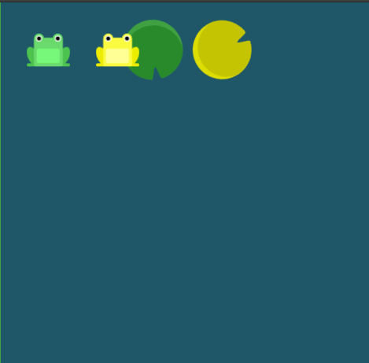 --->
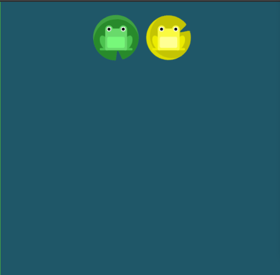

 

- [Level 3](/solutions/3.css)

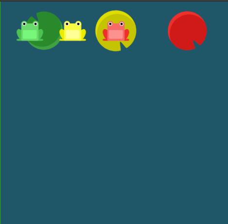 --->
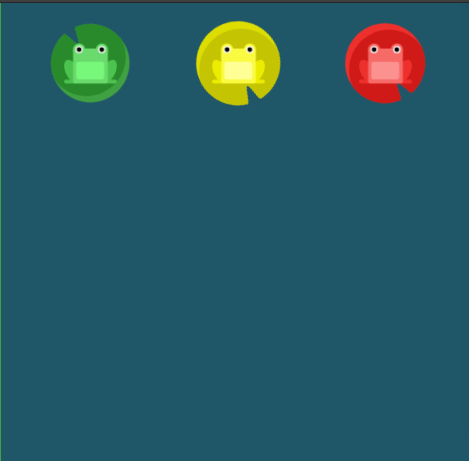

 

- [Level 4](/solutions/4.css)

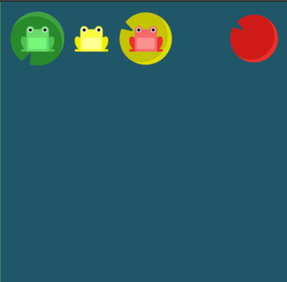 --->
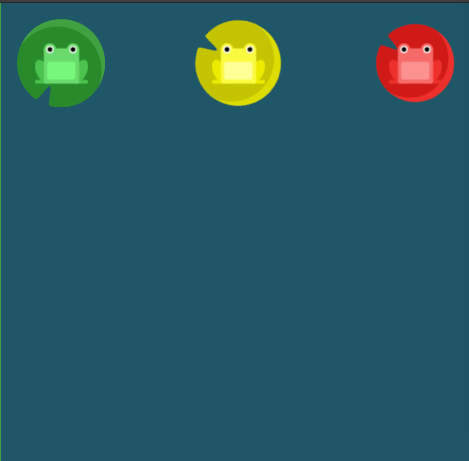

- [Level 5](/solutions/5.css)

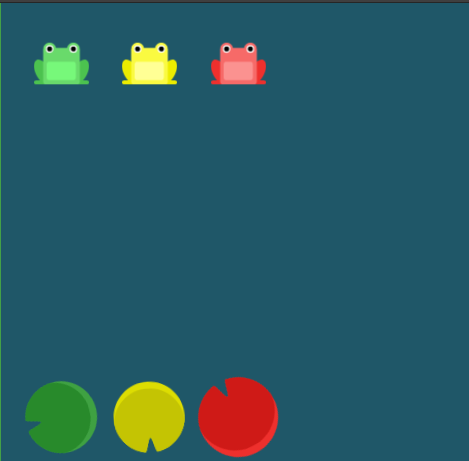 --->
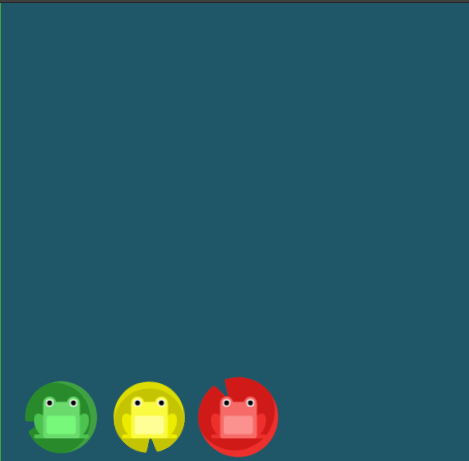

 

- [Level 6](/solutions/6.css)

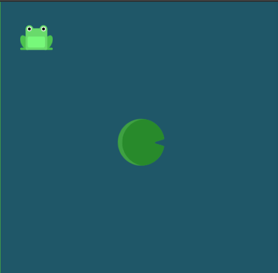 --->
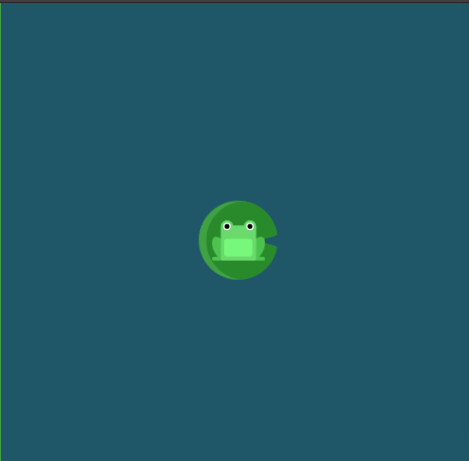

 

- [Level 7](/solutions/7.css)

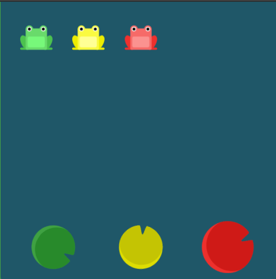 --->
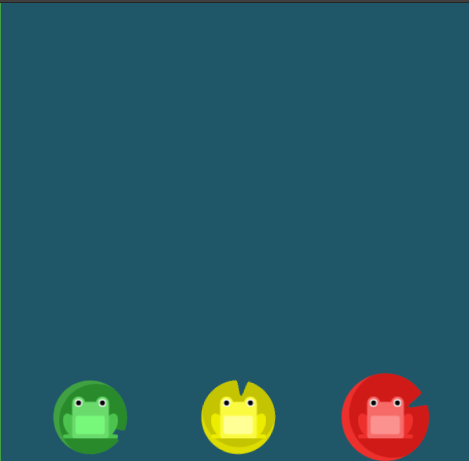

 

- [Level 8](/solutions/8.css)

 --->
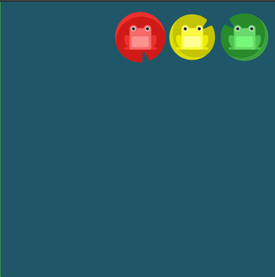

 

- [Level 9](/solutions/9.css)

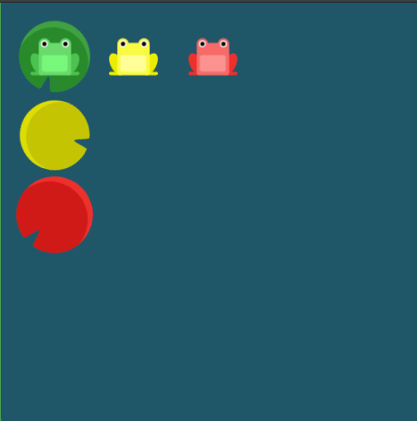 --->
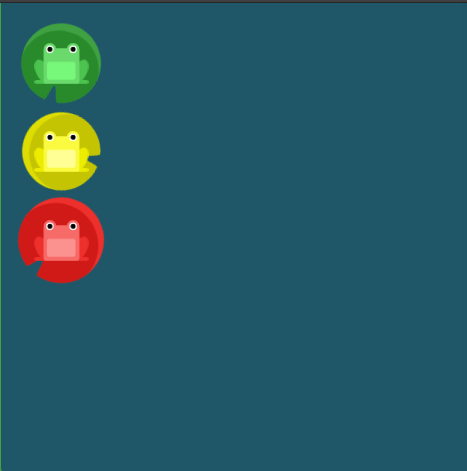

 

- [Level 10](/solutions/10.css)

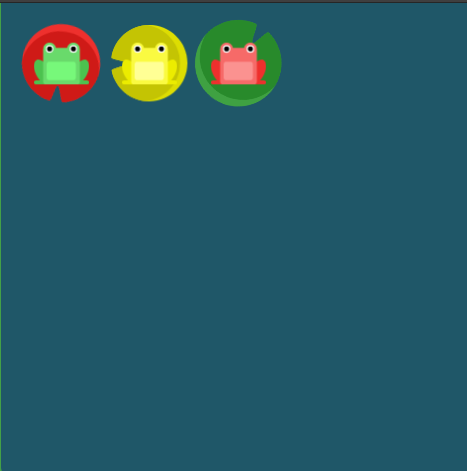 --->
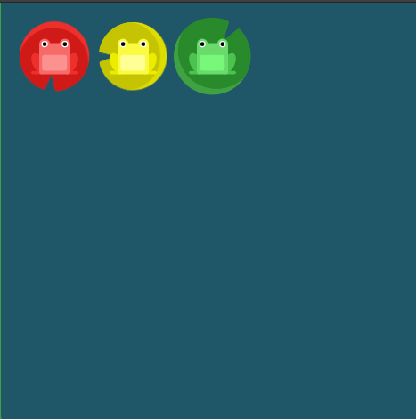

 

- [Level 11](/solutions/11.css)

 --->
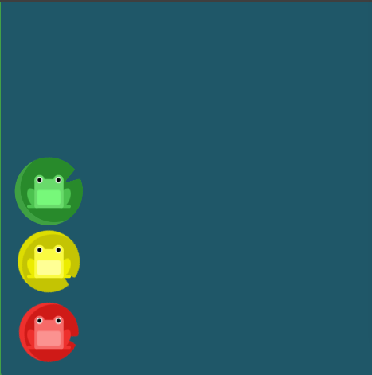

 

- [Level 12](/solutions/12.css)

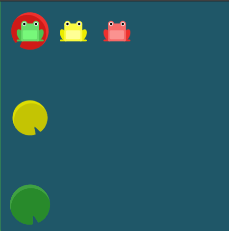 --->
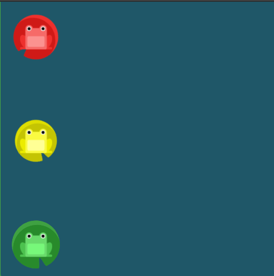

 

- [Level 13](/solutions/13.css)

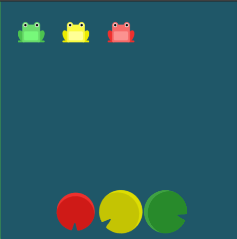 --->
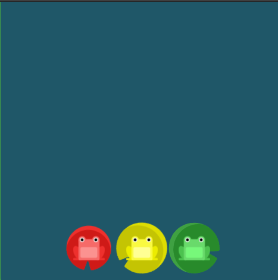

 

- [Level 14](/solutions/14.css)

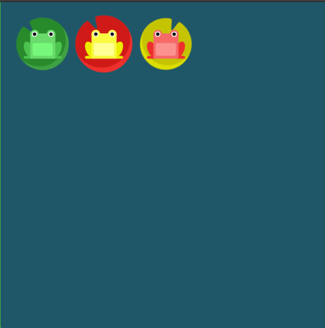 --->
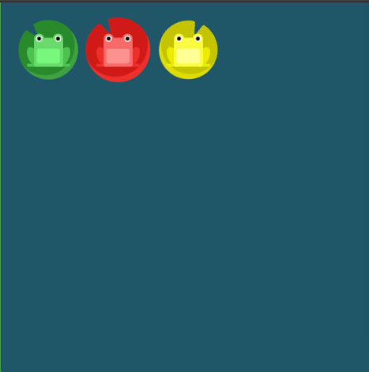

 

- [Level 15](/solutions/15.css)

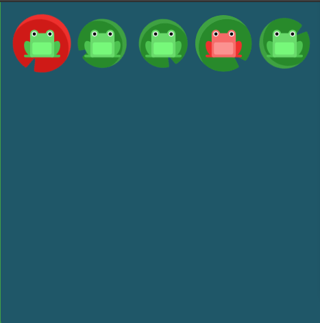 --->
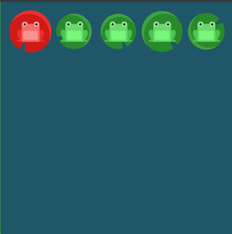

 

- [Level 16](/solutions/16.css)

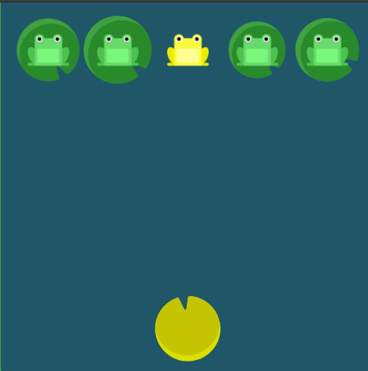 --->
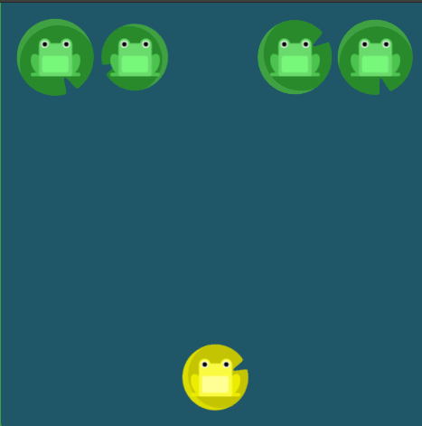

 

- [Level 17](/solutions/17.css)

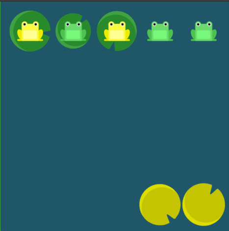 --->
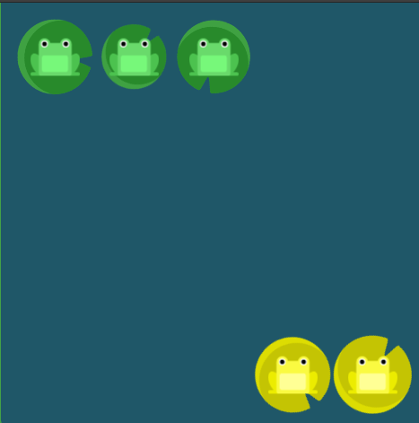

 

- [Level 18](/solutions/18.css)

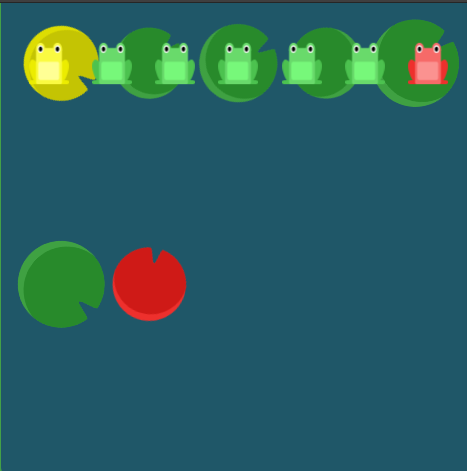 --->
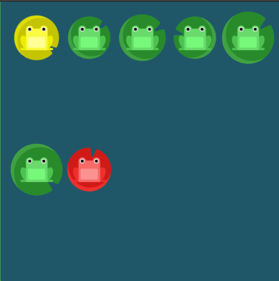

 

- [Level 19](/solutions/19.css)

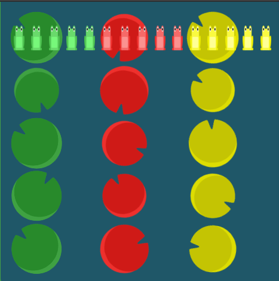 --->
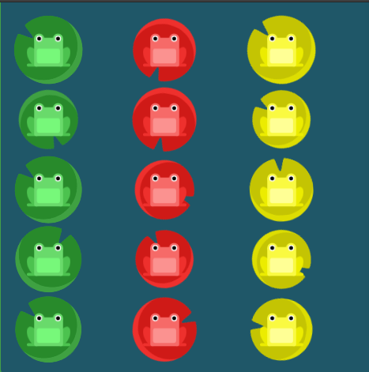

 

- [Level 20](/solutions/20.css)

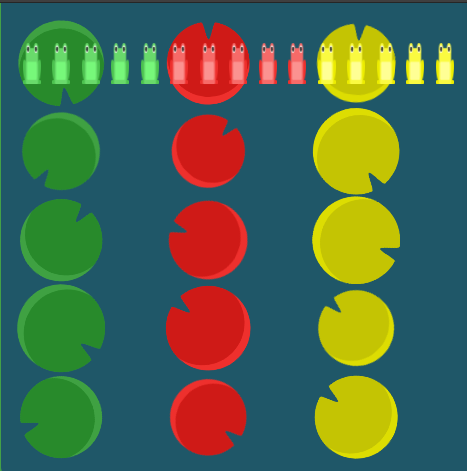 --->
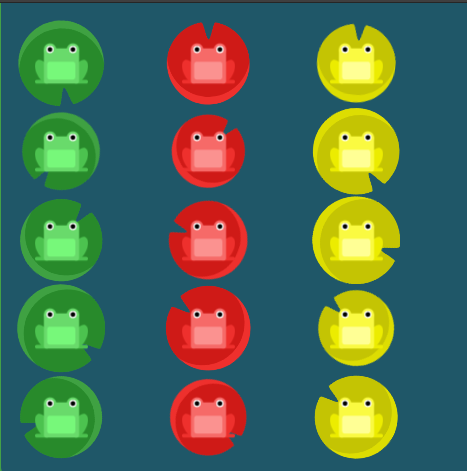

 

- [Level 21](/solutions/21.css)

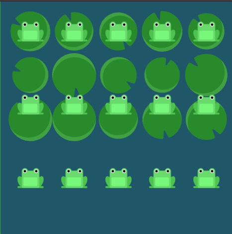 --->
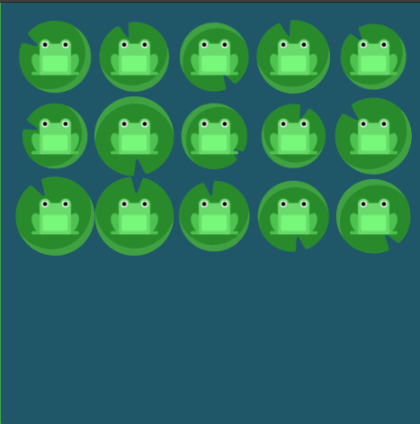

- [Level 22](/solutions/22.css)

 --->
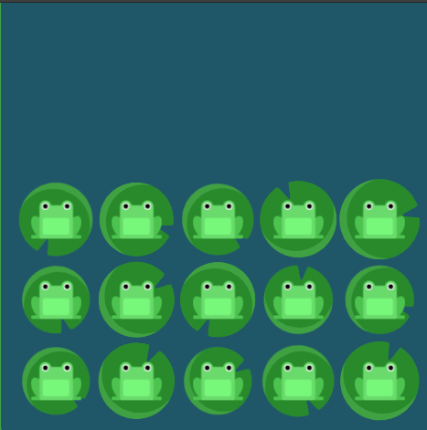

 

- [Level 23](/solutions/23.css)

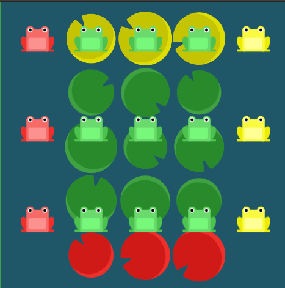 --->

 

- [Level 24](/solutions/24.css)

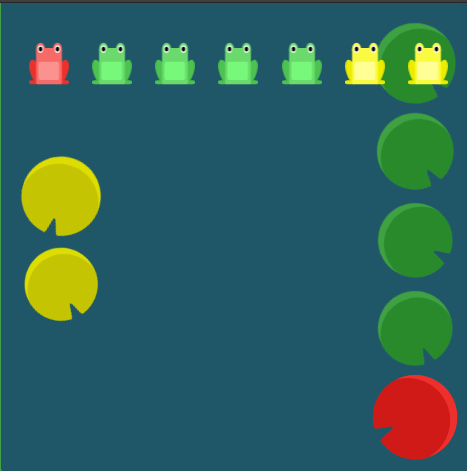 --->
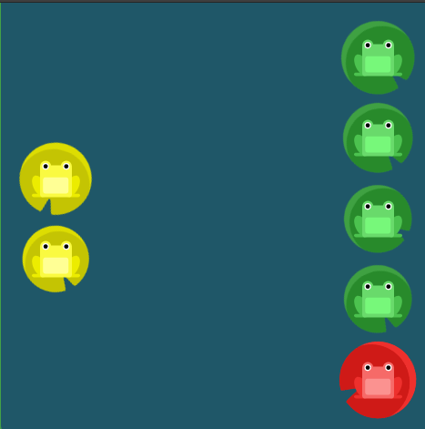

