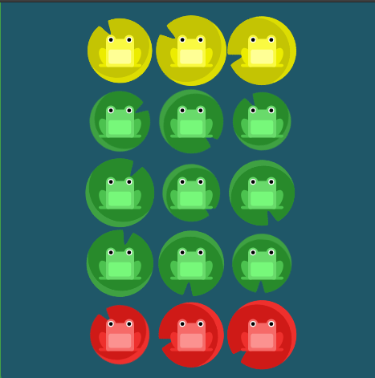

# Flexbox-froggy

[Flexbox Froggy](https://flexboxfroggy.com/) is a interesting way to learn Flexbox just using a browser.

It consists of 24 levels, each having a unique problem.

This repo helps for those who are stuck in a level.

Contains Solutions to Problems on [Flexbox Froggy](https://flexboxfroggy.com/)

## Solutions

- [Level 1](/solutionn/1.css)

 --->

 

- [Level 2](/solutionn/2.css)

 --->

 

- [Level 3](/solutionn/3.css)

 --->

 

- [Level 4](/solutionn/4.css)

 --->

- [Level 5](/solutionn/5.css)

 --->

 

- [Level 6](/solutionn/6.css)

 --->

 

- [Level 7](/solutionn/7.css)

 --->

 

- [Level 8](/solutionn/8.css)

 --->

 

- [Level 9](/solutionn/9.css)

 --->

 

- [Level 10](/solutionn/10.css)

 --->

 

- [Level 11](/solutionn/11.css)

 --->

 

- [Level 12](/solutionn/12.css)

 --->

 

- [Level 13](/solutionn/13.css)

 --->

 

- [Level 14](/solutionn/14.css)

 --->

 

- [Level 15](/solutionn/15.css)

 --->

 

- [Level 16](/solutionn/16.css)

 --->

 

- [Level 17](/solutionn/17.css)

 --->

 

- [Level 18](/solutionn/18.css)

 --->

 

- [Level 19](/solutionn/19.css)

 --->

 

- [Level 20](/solutionn/20.css)

 --->

 

- [Level 21](/solutionn/21.css)

 --->

- [Level 22](/solutionn/22.css)

 --->

 

- [Level 23](/solutionn/23.css)

 --->

 

- [Level 24](/solutionn/24.css)

 --->

